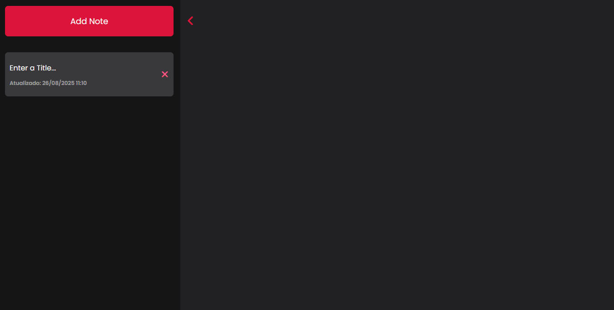
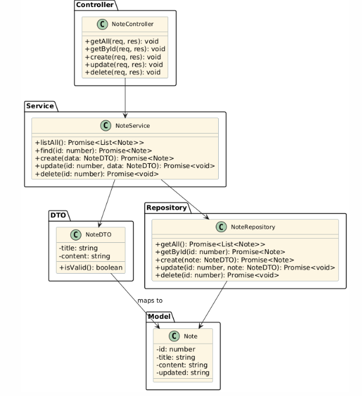
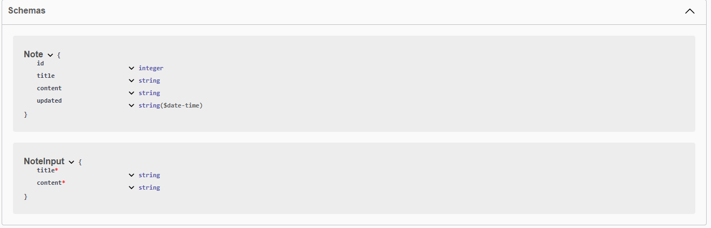
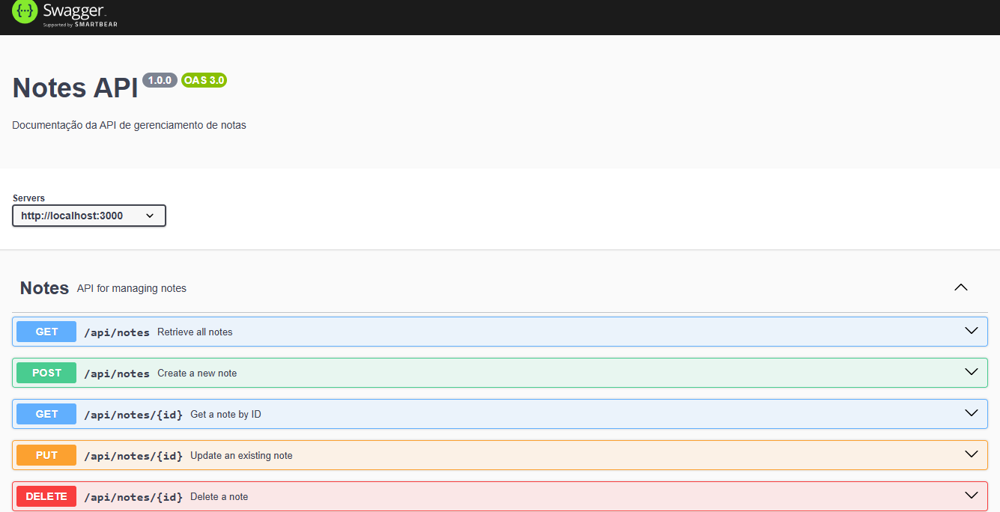

# Notes App



> Status do projeto: ✅ Concluído

<br/>

## Descrição do projeto

O Notes App é uma aplicação web fullstack desenvolvida para criar, editar e excluir notas de forma simples e eficiente. A interface é moderna e responsiva, com uma sidebar interativa e preview em tempo real. O backend foi construído com Node.js e SQLite, seguindo o padrão MVC, enquanto o frontend utiliza HTML, CSS e JavaScript orientado a objetos.
Este projeto é ideal para quem deseja organizar ideias, tarefas ou registros pessoais, e serve como base sólida para aplicações CRUD com persistência em banco de dados.

<br/>

## Diagrama de Classes


<br/>

## Documentação da API

Acessar no /api-docs

<br/>

## Documentação da API

Acessar no /api-docs

<br/>

## Funcionalidades

- Criar novas notas com título e conteúdo
- Editar notas existentes em tempo real
- Excluir notas com confirmação visual
- Visualizar data de última atualização
- Interface responsiva com sidebar animada
- Integração completa entre frontend e backend via API REST

<br/>

## Pré-requisitos

Antes de executar o projeto, verifique se você tem os seguintes itens:

- [Node.js](https://nodejs.org/) (versão 18 ou superior)
- [NPM](https://www.npmjs.com/)
- [Git](https://git-scm.com/)
- Editor de código (recomendado: [Visual Studio Code](https://code.visualstudio.com/))
- Sistema operacional: Windows, Linux ou macOS

Isso foi um exemplo de uma lista de pré-requisitos.

<br/>

## Instalação e Execução

1. Clone este repositório:
   ```bash
   git clone https://github.com/lmsiff/iff-notes-app.git
   ```
2. Instale as dependências:
   ```bash
   npm install
   ```
3. Inicie o servidor de desenvolvimento:
   ```bash
   npm start
   ```
4. Abra o projeto em seu navegador:
   ```bash
   http://localhost:3000
   ```
<br/>

## Uso
- Clique em “Add Note” para criar uma nova nota.
- Edite o título e o conteúdo diretamente no preview.
- Clique na lixeira para excluir uma nota.
- Use o botão de seta para abrir ou fechar a sidebar.
- As alterações são salvas automaticamente no banco de dados.

<br/>

## Testes

Para rodar os testes, siga os passos abaixo:

1. Certifique-se de que todas as dependências estão instaladas:
```bash
npm install
```
2. Execute os testes com o seguinte comando:
```bash
npm test
```
3. Você também pode verificar o relatório de cobertura com:
```bash
npm run test:coverage
```
Basicamente é só colocar o passo a passo para realizar os testes.

<br/>

## 📂 Estrutura de pastas

Abaixo está a estrutura de pastas do projeto:

```bash
├── controllers/         # API route logic
├── database/            # SQLite database configuration
├── models/              # Note entity structure
├── repositories/        # Direct database access
├── routes/              # REST route definitions
├── services/            # Business rules and validation
├── tests/               # Application tests
├── utils/               # Helper functions (e.g., validator)
├── views/               # Frontend (HTML, CSS, JS)
│   ├── index.html
│   ├── style.css
│   └── script.js
├── swagger.js           # Swagger documentation setup
├── jest.config.js       # Jest testing configuration
├── app.js               # Main server file
├── package.json         # Dependencies and scripts
├── .gitignore           # Files ignored by Git
└── README.md            # Project documentation
```

<br/>

## Tecnologias utilizadas

- Node.js
- Express.js
- SQLite3
- JavaScript (ES6+)
- HTML5
- CSS3

Font Awesome

<br/>

## Melhorias Futuras

- Implementar autenticação com OAuth (Google/GitHub)
- Adicionar paginação à lista de usuários
- Criar uma interface responsiva para dispositivos móveis
- Suporte a temas (claro/escuro)
- Testes automatizados com Jest
- Internacionalização (i18n) com suporte a inglês e espanhol

<br/>

## Criadores do Projeto
- Lucas Miranda Soares
- Everton Moura